# Project Analysis

---

## Website subject

The objective of this project is to create an engaging and professional online platform for the “Grace Dubbing Studio.” The website aims to showcase the studio’s expertise in voice acting and dubbing, offering a space to promote its services, highlight ongoing projects, and attract aspiring voice actors for training opportunities. With a user-friendly interface and dynamic multimedia elements, the site emphasizes the studio’s commitment to quality and its role in inspiring the next generation of talent in the voice acting industry.

---

## Files and Their Purpose

---

## index.html:
This file serves as the backbone of the website. It defines the website’s structure using HTML (HyperText Markup Language). It organizes the content, such as text, images, forms, and navigation menus, into a readable format for web browsers. HTML files are essential for defining the skeleton of a web page, ensuring all elements are displayed correctly.

## index.css:
This file handles the visual styling of the website. CSS (Cascading Style Sheets) controls the layout, colors, fonts, and other design aspects. It allows for the separation of content (HTML) from presentation, which makes the site easier to maintain and update while improving the user experience.

## index.js:
This JavaScript file adds interactivity to the website. It includes functionality like the display and management of a cookie banner, dynamic form behaviors, and responsive menu actions. JavaScript enables a more interactive and dynamic user experience, which is vital for modern websites.

## init.php:
This PHP file is used to initialize server-side configurations or database connections. PHP (Hypertext Preprocessor) allows for the creation of dynamic content by interacting with databases, managing sessions, or performing server-side logic. This is critical for features like forms and user submissions. IT IS A PLACEHOLDER

## Why do we need all these files?

- Separation of Concerns
- Scalability
- Enhanced User Experience

# HTML

## HTML 1

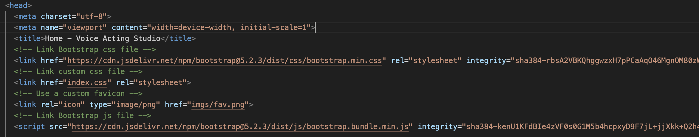

This HTML code creates the basic structure of a web page using Bootstrap

1. **Page Title:** <title>Home - Voice Art Studio</title> sets the name displayed in the browser tab.
2. **Bootstrap CSS:** Links Bootstrap’s stylesheet to style the webpage easily and make it look good.
3. **Custom CSS:** A separate custom stylesheet (index.css) allows for personalized styling.
4. **Favicon:** Adds a small custom icon (imgs/fav.png) visible next to the page title in the browser tab.
5. **Bootstrap JavaScript:** Adds functionality like dropdown menus or modals using Bootstrap’s JavaScript library.

## HTML 2

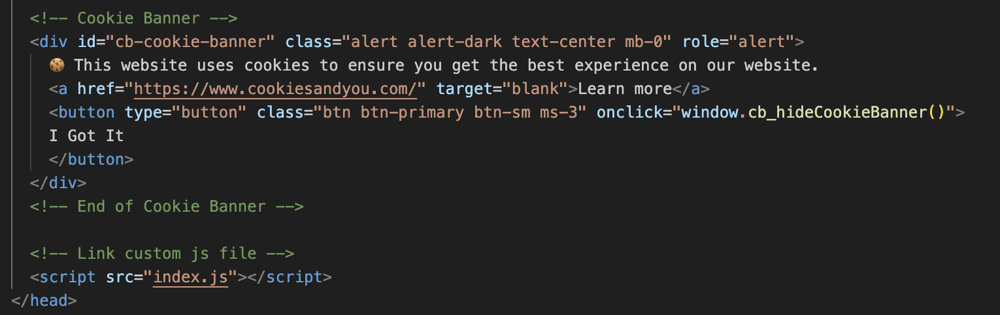

This code creates a cookie banner for a website

1. **HTML Structure:** https://kolappannathan.github.io/bootstrap-cookie-banner/
2.	**Button:** A button is shown with the text “I Got It”. When the button is clicked, it runs the JavaScript function cb_hideCookieBanner() to hide the cookie banner.
3.	**Styling:** The banner uses Bootstrap classes like alert, alert-dark, text-center for a styled alert box.
4.	**JavaScript File:** At the end, the file index.js is linked to the page. It likely contains the cb_hideCookieBanner() function that hides the banner when the button is clicked.

## HTML 3

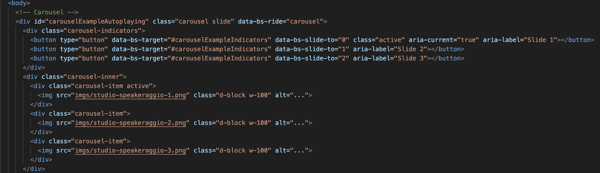

This code creates an image carousel (a slideshow) on a webpage using Bootstrap

1.	**Carousel Container:**
It’s wrapped in a div with the ID carouselExampleAutoplaying.
The data-bs-ride="carousel" makes the carousel slide automatically.
2.	**Indicators (Navigation Dots):**
The button elements at the top create small navigation dots.
Each button corresponds to a slide (Slide 1, Slide 2, Slide 3) and allows users to jump directly to that slide.

---

3.	**Slides:**
The carousel-inner container holds three slides.
Each slide is a div with the class carousel-item.
First Slide: Contains an image studio-speakeraggio-1.png and is marked as active (it appears first).
Second Slide: Displays the image studio-speakeraggio-2.png.
Third Slide: Displays the image studio-speakeraggio-3.png.
4.	**Image Display:**
Images are displayed in full width (w-100) and are responsive to fit the screen (d-block).
5. **How It Works:**
The carousel automatically rotates through the slides.
Users can manually navigate using the dots (indicators).

## HTML 4

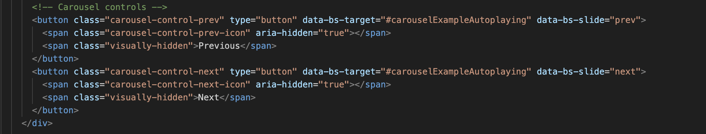

This code adds navigation controls (buttons) to a carousel slideshow.

1.	**Two Buttons:**
“Previous” button: Allows users to go to the previous slide.
“Next” button: Allows users to go to the next slide.
2.	**Attributes:**
data-bs-target="#carouselExampleAutoplaying": Links the buttons to the carousel with the ID carouselExampleAutoplaying.
data-bs-slide="prev" and data-bs-slide="next": Specify whether the button moves to the previous or next slide.
3.	**Icons and Text:**
Each button includes an icon (carousel-control-prev-icon or carousel-control-next-icon) to display arrows.
The "span class="visually-hidden">Previous span" and "span class="visually-hidden">Next span" text are for screen readers to improve accessibility.

## HTML 5

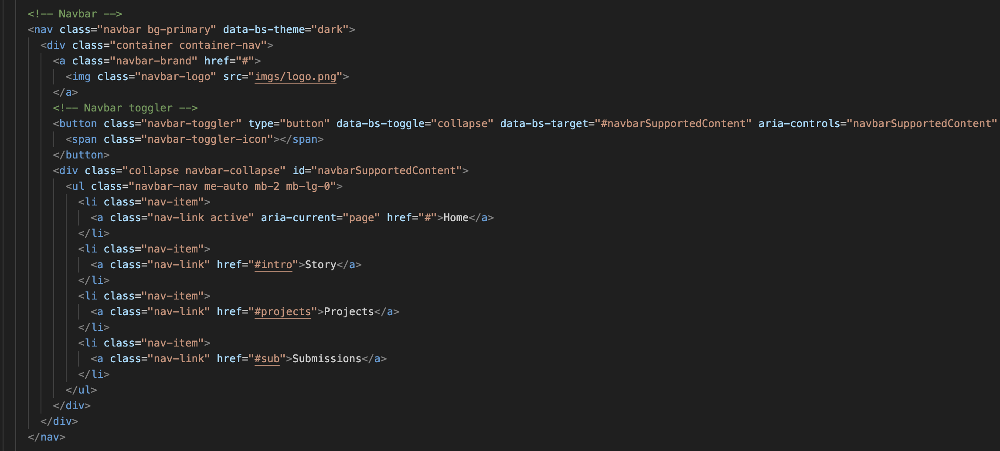

---

This code creates a responsive navigation bar (navbar) using Bootstrap

1.	**Navbar Container:**
It has a dark theme (data-bs-theme="dark") and a blue background (bg-primary).
2.	**Brand Logo:**
A clickable logo is displayed with an image (imgs/logo.png) and links to the home page (href="#").
3.	**Navbar Toggler:**
A “hamburger menu” button appears on smaller screens.
When clicked, it expands or collapses the navigation links.
4.	**Navigation Links:**
A list of links is displayed:
Home (active by default).
Story links to #intro.
Projects links to #projects.
Submissions links to #sub.
5.	**Responsive Behavior:**
The collapse class ensures that the links are hidden on small screens and displayed only when the “hamburger menu” button is clicked.

## HTML 6

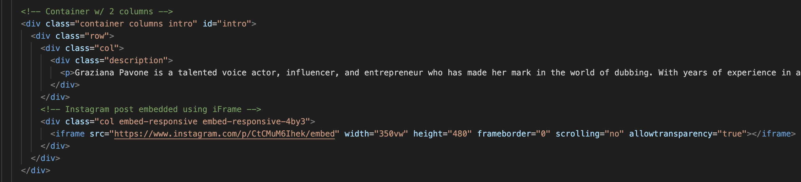

This code creates a 2-column layout with text on one side and an embedded Instagram post on the other.

1.	**Container Setup:**
A Bootstrap container (container columns) groups all content.
Inside it, a row divides the layout into columns.
2.	**First Column - Text Description:**
Contains a paragraph (p) that introduces Graziana Pavone as a talented voice actor, influencer, and entrepreneur.
3.	**Second Column - Embedded Instagram Post:**
Uses an iframe to embed an Instagram post.
An iframe (short for inline frame) is an HTML element used to embed another document, web page, video, or other external content into the current webpage.

## HTML 7

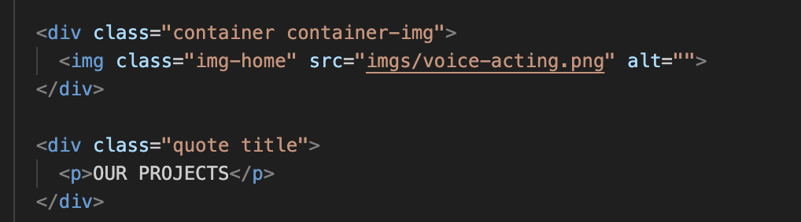

This code displays an image and a text heading on a webpage.

1.	**Container for the Image:**
The div with class container container-img wraps the image.
The img tag displays an image located at imgs/voice-acting.png.
It has the class img-home for styling purposes.

2.	**Text Section:**
A div with the classes quote title contains a paragraph.
The p tag displays the text “OUR PROJECTS” in bold or styled format.

## HTML 8

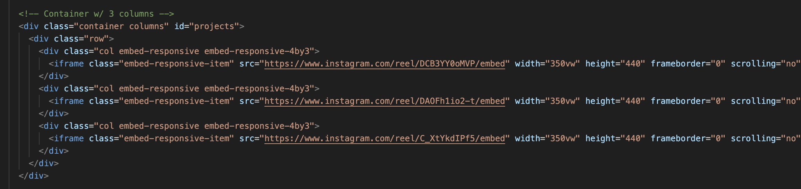

This code creates a 3-column layout that embeds Instagram posts side by side on a webpage.

1.	**Container Setup:**
A container holds all the content and is identified by id="projects".
Inside it, there’s a row to organize the columns.
2.	**Three Columns:**
Each column (col) contains an iframe.
The iframe embeds an Instagram post using its src link.
3.	**Attributes of the iframe:**
Embed-responsive-4by3: Ensures the iframe maintains a 4:3 aspect ratio for responsiveness (https://stackoverflow.com/questions/25228056/responsive-iframe-using-bootstrap)

## HTML 9

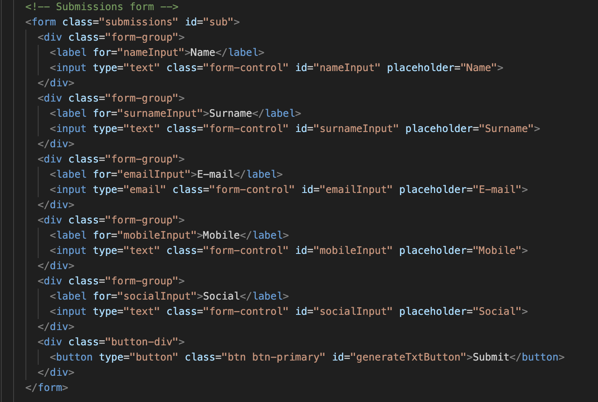

---

This code creates a submission form that collects user information, such as name, surname, email, mobile, and social details.

1.	**Form Container:**
The form element has a class submissions and an ID sub. It groups all the input fields and the submit button.
2.	**Input Fields:**
Name, Surname, E-mail, Mobile, Social 
3.	**Submit Button:**
A button element styled with btn btn-primary that shows the text “Submit”.
Type="button": This button does not submit the form by default; it would need JavaScript to handle actions.
4. **How It Works:**
Users fill out the form fields (Name, Surname, Email, etc.).
The form is clean and styled using Bootstrap classes (form-control and btn btn-primary).
The submit button can be used to trigger an action, such as sending the data or validating the form.
**It is a placeholder because php has not been fully implemented**

## HTML 10

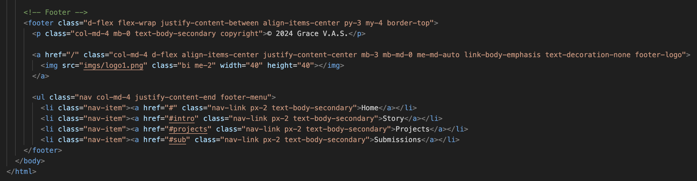

This code creates a footer section for a webpage.

1.	**Footer Container:**
The footer uses Bootstrap classes like d-flex and flex-wrap to create a flexible and responsive layout.
The content is aligned horizontally and evenly spaced.
2.	**Copyright Text**
3.	**Logo Link:**
A clickable logo is added using an a tag.
The logo image (imgs/logo1.png) is displayed at a size of 40x40 pixels.
4.	**Navigation Links:**
Each link is styled using Bootstrap classes like nav-link and text-body-secondary.

# CSS

## CSS 1

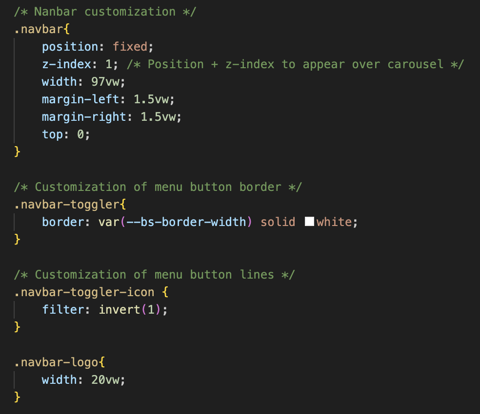

This CSS code is for Navbar Customization:

- Styles the navigation bar (.navbar) as fixed with a width of 97vw and centered margins.
- Adjusts the menu toggle button (.navbar-toggler) border to a white solid color.
- Inverts the menu toggle icon color.
- Sets a width for the navbar logo.

## CSS 2

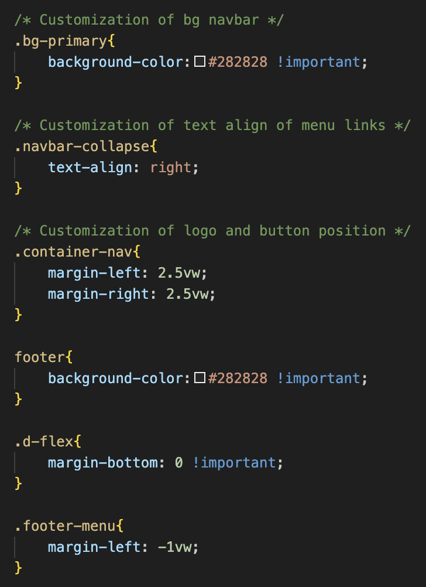

This CSS code is for Background and Alignment:

- Sets a dark background (#282828) for elements with .bg-primary and footer.
- Aligns menu links in the navbar to the right (.navbar-collapse).
- Adds margins for the logo and button container (.container-nav).
- Sets margin-botton=0 using .d-flex class

## CSS 3

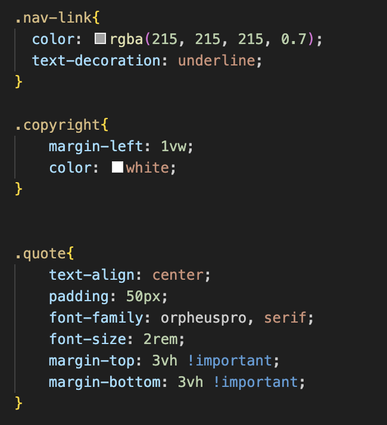

This CSS code is for Links and Footer Text:

- Styles navigation links (.nav-link) with a semi-transparent white color and underline.
- Adjusts copyright text color and margins.
- Centers and styles a quote (.quote) with custom font, padding, and spacing.

## CSS 4

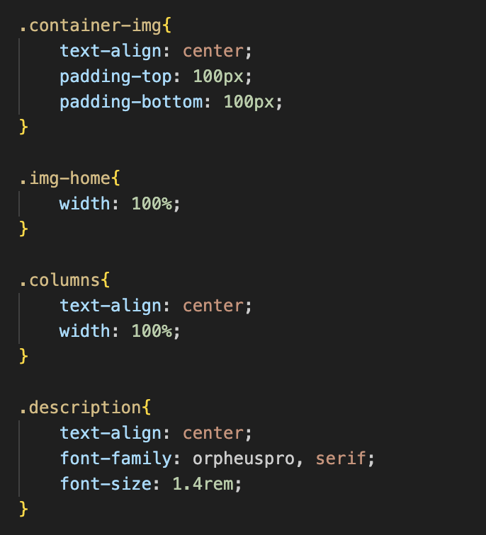

This CSS code is for Content Container Styling:

- Centers and adds vertical padding to an image container (.container-img).
- Ensures images and columns span full width (.img-home, .columns).
- Centers text and adjusts font for descriptions.

## CSS 5

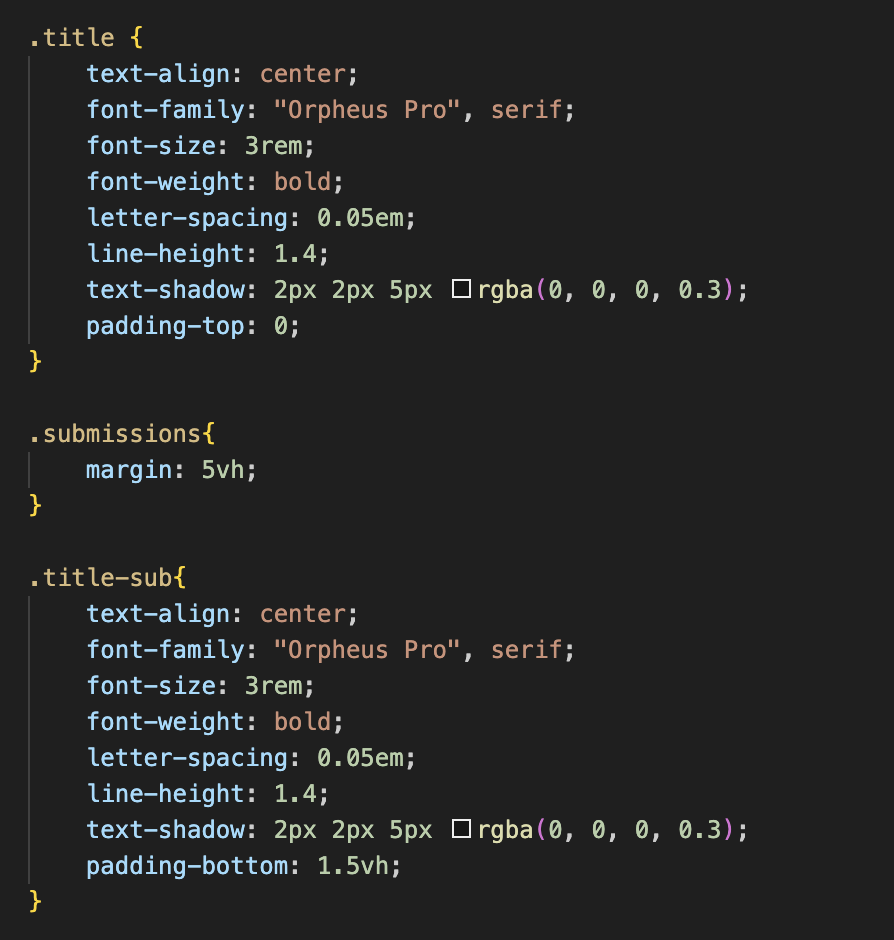

This CSS code is for Title and Submissions:

- Customizes titles (.title, .title-sub) with centered text, bold styling, shadows, and proper line spacing.
- Adds margins for a submissions section.

## CSS 6

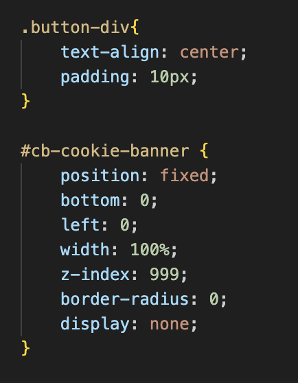

This CSS code is for Button and Cookie Banner:

- Centers button content and adds padding.
- Styles a cookie banner (#cb-cookie-banner) as fixed at the bottom of the screen with a high z-index but hidden by default (display: none).

# JS

## JS 1

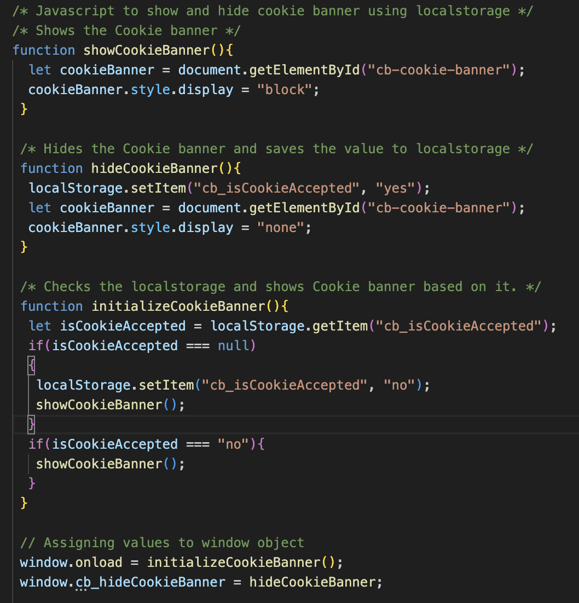

This JS code is for Cookie Banner Logic (https://kolappannathan.github.io/bootstrap-cookie-banner/):

- Displays or hides a cookie consent banner based on localStorage.
- showCookieBanner() displays the banner.
- hideCookieBanner() hides the banner and sets cb_isCookieAccepted to “yes” in localStorage.
- initializeCookieBanner() checks if the user has accepted cookies; if not, it shows the banner.

## JS 2

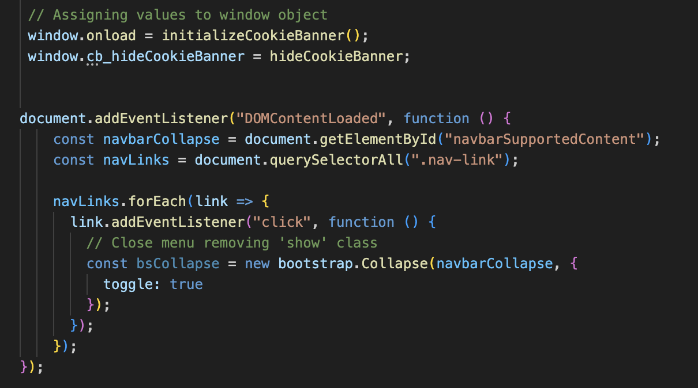

This JS code is for Navbar Collapse on Link Click:

- Listens for clicks on navigation links (.nav-link).
- When a link is clicked, it collapses (hides) the Bootstrap navigation menu by toggling its visibility using bootstrap.Collapse.

## JS 3

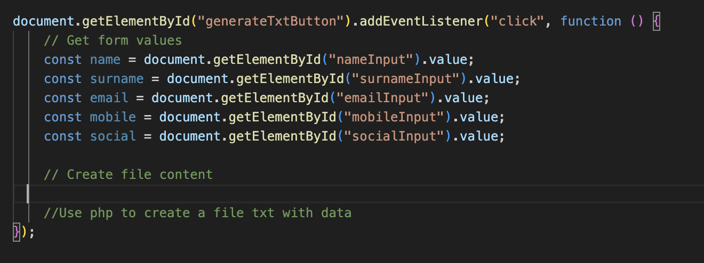

This JS code is for Collect Form Data on Button Click:

- Adds an event listener to a button (generateTxtButton).
- Retrieves values from form inputs (name, surname, email, mobile, social).
- Prepares data to create a text file using PHP (commented but not implemented).
- **IT IS A PLACEHOLDER - NOT IMPLEMENTED**

# PHP

**IT IS A PLACEHOLDER - NOT IMPLEMENTED**

# Acknowledgments
Thank you very much for your time and attention. I truly appreciate your effort in reviewing this and look forward to any feedback or suggestions you might have.
